防守股选股+ Google 深度分析配仓策略
# 防守股选股+ Google 深度分析配仓策略

近期股市总结 + 两支华尔街机构都在配的防守股 + 防守股配仓技术 + 谷歌大涨后分析以及补仓/建仓教学 + 选股组合进行收益回测和分析 + 模拟未来高风险事件下选股组合的整体防御力和分析

16567字

原创  JACKAL量化投资

### 近期股市总结

8，9月我们收获的非常非常多，无论是芯片还是到data center几乎全都是全面开花，让我们赚得盆满钵满，我们有的人继续遵守个人的投资准则，有的人则开始上头，听信股市‘牛市神棍’的话疯狂上杠杆，加仓，生怕错过如此大的momentum（股票动能 指的是股票借势上涨）。最后在10月到现在，几乎被超高的杠杆洗劫一空。。无论是之前的利润还是本金几乎都被消耗殆尽，甚至更严重的直接爆仓被股市彻底洗刷出去。

这，是你们最重要的一课。让你们明白一个重要的道理，不要在股市连续上涨的时候做多，而是应该策略性的止盈齐全，不要加仓正股。在股市回调的时候应该等回调结束信号显现在开始顺势抄底（尽管错过最低位也没关系，因为你不是内幕交易 你也不是机构 你无法知道低在哪里，顶点在哪里）。我们要借势，去赚钱。这也就是为什么我每个帖子都强调，止损位，站稳。

让我们来复盘几个我个人认为最重要的事件，贯穿10-11月底的股市回调。你们可能有时候会留意，部分留言会说 ‘大盘才跌了xx%，这也叫回调？’。这属于定投大盘的主，并没有任何的资金在tech或者高波动的成长股里，当高波动股跌了15% 大盘只跌了 2%，他们当然觉得，这也叫回调？对于这种人，当做看不见就行，因为我们投资风格并不属于一个频道，只定投大盘的就是我们所谓的：‘只为了去对抗通货膨胀的那批人罢了’，而不是想赚钱。

起点，应该我们所有人都记忆清晰。自从特朗普在数周前发表的对华关税之后，市场瞬间跌入谷底，尽管周末过后的周一开始反弹，但是这无法阻挡空头的借势头，从这次事件导火索之后，股市开始持续下跌，尽管有所反弹，但是把那些有中短期期权的投资者几乎给杀光了，期权的time value几乎被压榨的一滴也不剩，最难受的是被多空双杀的投资者，也就是那些自以为在低点抄底大笔资金买看多期权搏反弹，或者在低点大笔资金做空自以为股市会crash的那伙人。

第二件我认为最重要的事情是美联储的10月降息。尽管已经如实降息，但是我们之前有在帖子里面强调过很多，我们要看的是 美联储对12月降息的态度！果然，当美联储放鹰之后，股市开始暴力下跌，同时伴随十年国债价格拉涨。polymarket的12月降息概率直接从90%降息概率下滑到现在只有50%。。 这些都是近期股市下跌的核心理由，尤其是最近几天各种美联储的官员跑出来在X上说 12月，不降息类似的言语。导致大跌总是迫不及防(后续50%回升至85%，请看我的小红书大号最新帖子对其的分析)。

第三件我认为很重要的下跌低迷原因则是 降息后 伯里这个曾经靠08年危机大赚一笔的空头开始大笔做空pltr和nvda这两个tech sector的龙头股，从而导致整个AI板块承压，最先吸收此风险和亏损的股票种类则是data center这些最基层的 杠杆最大公式，最典型的例子就是 Oracle 和NBIS等。这是我们无法预料到的，但是这些股票会很快的回归巅峰。。因为这是趋势，按照我说的，你们是在投资一个未来能改变人类生活的股票，我们无法离开的股票，你在怕什么呢？你投的不是MP那种政治产物，被政治家们玩完就丢的公司，而是AI的大心脏股票，data center。

当你想卖掉股票的时候，你会恐慌，你会也许打开豆包，gpt问问意见，但你有没有想过你在问意见的时候就已经变相的在给data center ‘送钱了’？ 如果无法承受高波动，应该去买我Growth选股的前两只和接下来我要推荐的几只股票。

第四件事则是我们最万众瞩目的英伟达财报，抱歉各位我当时在忙于工作无法陪伴。英伟达财报十分优秀的毛利率和需求量是绝对的市场savor，但是架不住人们对于 12月降息不确定恐慌而导致的恐慌性抛售。前几日的市场恐慌性已经到了6。。这是很罕见的极度恐慌。而机会也会随之出现，如果有反弹则是非常非常强力的。

可。。有些朋友们的钱已经被前一阵子的各种乌龙事件榨干，已经无弹药再补仓或者有些朋友终于勇敢了一次 买了高波动股但是亏的裤衩子都没了，实在想多配仓一些防御股票和高质量mega7成长股，不知道该怎么办。

讲了这么多血泪史，现在回到正题：你们之所以被高波动股、期权和杠杆来回摩擦，很大一部分原因，是组合里几乎没有真正意义上的防守股。所以今天这段就当成一节“组合配置课”，讲讲防守股在你 portfolio 里的作用和玩法。

防守股不是用来赚快钱的，是用来帮你扛回撤、稳心态的。

如果你手里只有高beta成长股 + 短期期权，那每一次宏观风吹草动，你的账户就是直接进ICU。防守股的作用很简单：

在大盘回调、科技股腰斩的时候，它们跌得少，甚至不怎么动；让你在账户浮亏的时候，还有一块“稳定区”，不至于情绪失控乱砍仓；

给你腾时间，等利空出尽再慢慢换回高成长标的，而不是直接被爆仓请出市场。

我们之前把各种配置分成五大块，然后有很多小白读者会觉得特别难配置理解，尤其是还有债券配置的粉丝，所以简单化的来讲，以后你可以把自己的美股仓位粗暴分成两块：

一块叫“进攻”（AI、半导体、data center、各种高弹性），

一块叫“防守”（消费必需 + 医疗 + 公用事业/电信里那些现金流稳定、波动低的）。

大致比例你自己量力而行，我会在股票后面详细写适合不同level投资者的投资方法和配置方法技巧。

### 先说两个被低估的我认为最优秀的防御股，其中第一只，就是被市场严重误解、甚至被很多散户因为偏见而忽视的AAA级巨头——强生（JNJ）

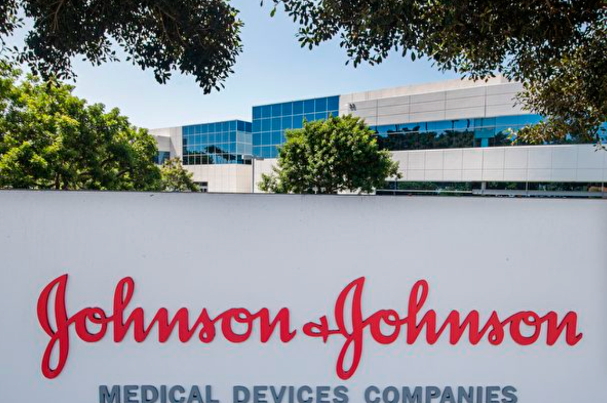

提到强生，大家的的第一反应可能觉得它“太慢了、太老了”，甚至印象还停留在其婴儿爽身粉和创可贴上。同时又有很多人会问，老师，这种老股票，怎么可能带我们在现在的行情里赚大钱？ 但这正是我想给你们上的第一课：这种“认知偏差”，恰恰是华尔街机构收割散户的最佳掩护。 我们的核心目标，绝不是像赌徒一样去博一个一夜暴富的翻身，而是在当前这个宏观环境极度不确定的乱世中，先企稳，再追求高质量的稳健增长。

现在的强生，早已不是你们印象里的那个杂货铺了。你们可能没注意到，2023年强生完成了一次历史性的资本运作，它将你们熟悉的消费品业务（Kenvue）彻底剥离分拆。这意味着什么？这意味着强生完成了一次脱胎换骨的“资产提纯”。现在的强生，只保留了两块核心、技术壁垒最高、利润最丰厚的业务：创新制药和医疗科技。

请各位记住，剥离之后，它的毛利率中枢被永久性抬高了，毛利率是每个公司估价的最重要一环（Oracle就是因为毛利率低（重要原因之一）而被市场错杀到现在）但强生，它不再需要为了卖一瓶几块钱的润肤露去打价格战，而是专注于那些拥有极高准入门槛、极高定价权的“救命生意”。市场现在的定价逻辑非常滞后，还在用以前那种“综合性大卖场”的低估值模型给它定价，而实际上，它已经进化成了一家高科技生物医疗巨头。这种大众认知的滞后，就是我们进行价值套利的第一层空间。

为什么我现在要让大家重点关注这只股票？因为在大家都在盯着AI泡沫会不会破、美联储会不会鹰派发言的时候，强生提供了一个完美的“不对称收益”模型。

#### 我们来拆解一下最核心的逻辑——估值错配。

哪怕你是第一次接触美股，这个商业逻辑你也必须听懂。 很多人只看PE（市盈率），觉得19倍也不算特别便宜。但是机构的算法模型不同，我个人的模型集合买方组合策略的用的是分部估值法（SOTP）。我们把强生拆开来看： 第一部分是它的制药业务，这是现金流核心支柱，这部分哪怕给个保守估值也支撑了大部分市值。 而最关键的是第二部分——它的医疗科技（MedTech）板块。这部分才是被大众严重低估的地方！这里面涵盖了全球最顶尖的心脏泵（Abiomed）和正在布局的手术机器人。大家可以去对比一下同行业做高增长器械的公司，比如波士顿科学，PE普遍都在25-30倍。

那么现在的股价意味着什么，意味着你在按打折价买入它制药业务的同时，市场几乎是“免费赠送”了你一部分高增长的医疗科技业务，资金最终会发现这个价差，这就叫估值修复，也是这笔交易中最确定的利润来源。

当然，我知道肯定有同学会问：“Jackal老师，我看新闻说它面临专利悬崖，还有滑石粉诉讼要赔很多钱，这不是很危险吗？（两大所谓的不确定性因素）” 作为一个成熟的投资者，不要被新闻标题党左右情绪，我们要学会做最硬核的压力测试。

#### 关于专利悬崖，空头最喜欢拿它的一款老药Stelara过期来做空。

但如果你像我一样深入研究它的研发管线（Pipeline），你会发现这个坑早就被新药填平了 比如治疗多发性骨髓瘤的Darzalex，年销售额正冲向100亿美金；还有治疗肺癌的新药Rybrevant，这都是正在爆发的增长点。所谓的“悬崖”，在机构的现金流模型里，其实只是一条平滑的过渡线，完全可控。

至于那个让人闻之色变的滑石粉诉讼，我只说一个让所有空头都无法反驳的财务事实： 强生是全美唯二拥有标准普尔“AAA”级信用评级的上市公司（另一家是微软）。 各位知道AAA级是什么概念吗？这意味着它的信用评级比美国政府还要高的。它账上躺着200多亿美金的现金，每年光是自由现金流（除去所有开销后纯赚进口袋的钱）就能赚回来200亿。 即使做最坏的打算，赔偿一百亿，对它来说也就是半年的零花钱，根本伤不到筋骨。而且，目前的股价（$200附近）其实已经把这种“毁灭性打击”的极度悲观预期都跌进去了（price in）。一旦未来和解落地，这个压制估值的不确定性消除，股价的弹性会瞬间释放。

#### 然后我来手把手教你们如何结合现在最新的数据图（11/24/2025）来配仓

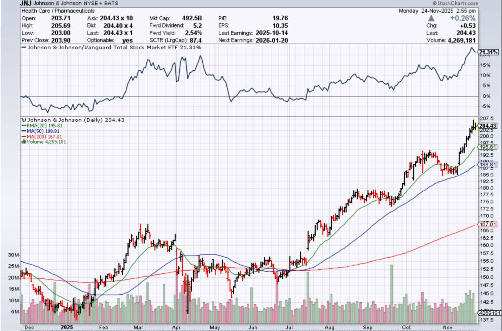

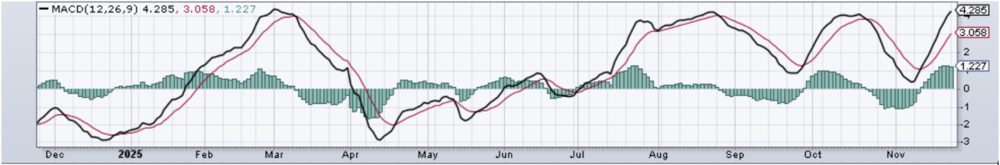

先看最新盘面：JNJ 现在收在 204.43，日内高点 205.69，基本贴着阶段新高在走。相对强弱线跑赢大盘 21.31%，说明这不是散户自嗨，是有持续资金在抬。均线位置也很清楚：20日线 195.81，50日线 188.81，200日线 167.01。它的问题也同样明显：这段上涨走得太顺，回头不多，所以下一步最常见的剧情不是“立刻继续暴冲”，而是冲高后回踩，把追高盘和没计划的人洗出去。

#### 根据评论区粉丝的意见，让我提前注释风险和购买前提风险预估，我把“回撤范围”直接给你们算出来，避免你们只看上涨空间不看下行代价。

以 204.43 为基准，正常回踩到 20日线 195.81，大概是 -4.2%；回踩到 50日线 188.81，大概是 -7.6%；极端情况下砸到 200日线 167.01，就是 -18.3%。这三档分别对应三种市场状态：轻回调（洗情绪）/中回调（洗仓位）/大回调（洗人）。你如果现在在 200–205 追进去，必须先问自己一句：你能不能扛住 4% 的回撤？扛不住就别进；扛得住 4% 但扛不住 8%，那就只允许小仓试探；扛得住 8% 才谈得上“按计划补仓”。

#### 所以第一条铁律我会写得更硬一点：200–205 不是“满仓点”，是“先上车占坑点”。

你先定好长期给强生配多少，比如你计划它占你股票资产 8%–10%，那现在这个位置我只让你先上 30%–40%计划仓（大概就是 3% 左右的底仓）。这一步的意义只有一个：我拿到筹码，但我预留子弹，防止市场给你一根阴线就把心态打崩。

#### 第二步开始进入“手把手操作”。我会把加仓分成两刀，并且每一刀都写清楚“价格区间 + 站稳信号”，不让你们凭感觉硬抄。

第一刀加仓区：196–197（靠近20日线195.81）。这是最常见、最健康的回踩区。你不要看到跌就扑上去，你要等一个“回调结束信号”：比如出现明显下影线止跌、或者连续两天收盘重新站回 20 日线附近，同时成交量开始缩。满足这些条件，你再把仓位从 3% 加到 6% 左右。这叫顺势加仓，不叫接飞刀。（如果小白朋友不懂如何看技术指标比如下影线 则可以把我的文字给AI 让它帮你判断是否目前的图形和量符合我所说的加仓标准）

第二刀加仓区：189–190（靠近50日线188.81）。这档回撤一般伴随市场更大范围降温，比如利率、宏观、情绪一起压。这里的逻辑是：如果公司基本面没变、只是市场一起恐慌，那 50 日线附近往往是中期资金愿意重新接手的位置。操作上同样不要冲：你要等它“跌不动了”，比如横几天不再创新低、出现放量止跌K，然后再把仓位从 6% 补到 8%–10%。到这一步，你的成本结构就舒服了，后面哪怕横盘磨一段，你也不会天天想砍仓。

#### 第三条我会专门写给你们当风控线：如果股价有效跌破 188.81（50日线）并且连续几天都站不回去，那就先停手，不加仓。

因为这时候市场给出的信号已经不是“正常回调”，而是在告诉你：这段趋势可能要换档。强生再稳，也不值得你用情绪去硬抗一个明显变差的结构。

再极端一点的 167–170（靠近200日线167.01），我会把话说得更重：这不是“抄底点”，这是“需要复盘原因的坑”。到了这里你必须先做判断：到底是市场恐慌误杀，还是公司出现结构性问题。如果只是市场抽风，那这里才谈得上长线慢慢捡；如果是公司逻辑被改写，那就宁可不买，别逞强（甚至把这个点作为长期正股的止损点）。

#### 最后讲“怎么拿、怎么减”，也补上风险视角。

强生我一直建议拆成两块：底仓 + 机动仓。底仓的任务就是稳定净值，别被市场情绪带着跑；机动仓才负责做再平衡。你可以写得更具体一点：如果未来涨到 230 附近，且价格明显远离20日线、连续多天拉升不回头，这种时候不是让你兴奋加仓，而是提醒你“该把机动仓减一部分，把进攻仓/现金补回去”，让组合重新回到你设定的比例。防守股不是用来追高的，防守股是用来让你在乱世里活下来的。

我用一句话收尾：强生这票的价值不是让你爽，而是让你稳。你按计划分批、按信号加仓、按风控停手，才叫专业，不然再好的基本面也会被你用错误的节奏变成痛苦仓。

#### 同时有些小白粉丝非常好奇，如果这种稳定防御股在一直往上蹭不给回调的机会我们该怎么补仓，策略是什么呢？

如果出现那种一路不回头、像打了激素一样狂拉的走势，你要立刻把心态从“等回调再买”切换成“趋势型建仓”。这种走势不能靠幻想回踩，而要靠规矩硬控节奏，否则你会永远等不到，越等越急，最后反而在最高点失控追进去（Circle也许是一个比较好的例子）。

第一段：底仓一定要先拿到手

如果股价连续挂在 20 日线上方每天抬高、几乎不给任何“回头”的机会，那你还在犹豫，就已经输给节奏了。这种情况下最正确的做法就是——先锁定底仓，不管你最终目标是配 8% 还是 10%，至少把 3%–4% 先买到手，哪怕价格是 204、205、207 都无所谓。底仓的意义是：你不是赌短线，你是在拿一张长期的稳健筹码，无论未来有没有 pullback，你都不会错过主升段。

第二段：改用“突破追踪法”，每突破一段补一点

不回调的走势，你不能等线等位置，你只能等结构。比如强生突破 205 站稳，就是一个结构；突破 210 再站稳就是下一个结构。你把最终打算配置的份额分成三段：底仓 3%–4%，突破补仓 2%，强势延续再补 2%–3%。这样你永远不会被甩在身后，却也不会在高位一口气梭哈。趋势越强，你的仓位越完整，但你始终留有余地，不会被任何一次假突破套住。

第三段：设置“风控止损线”，防止直线上升后的急杀

一路不回调最容易出现的问题，就是突然一天高开低走、吞噬长阴，这种杀伤通常比正常回调更狠。所以你必须在心里画好“强势止损线”：如果有一天跌破升势中的上一段结构，比如有效跌破 202–203，或者连续两天收在 20 日线下，那机动仓要先砍掉，底仓继续拿。不让一根阴线把你洗出局，但你也不能当着趋势转弱装看不见。

第四段：强势股永远不能追高满仓，要靠“跟涨不追涨”

一路不回调是好事，但最危险的也是一路不回调。你的操作核心不是“怕买贵”，而是“不能被套在最高点”。你永远不把仓位一次性打满，而是保持“涨一点补一点，跌一点停一下”的节奏。这样做的好处是——如果趋势延续，你一路被带上山；如果突然反转，你永远只在局部高点，绝不会在绝对顶点。

第五段：永远记住强生的定位——赚钱第二，活着第一

防御股不是用来追风口的，而是用来稳住净值、在动荡市场里帮你撑住心态的。一路拉升时你可以跟它走，但绝不能把它当成英伟达那种加速器。强生涨得慢，但回撤也轻；你想在暴动行情里靠它赚快钱，本身就是错位使用

### 第二只股票我要推荐的，则是我个人portfolio里面的防守大师股票，TJX Companies，这是一个比较激进的防守股，适合想要配置防守仓位同时也愿意承担一些些风险 想取得超额收益的投资者。（但它归类为防守股要比普通的高波动tech股风险小很多很多）

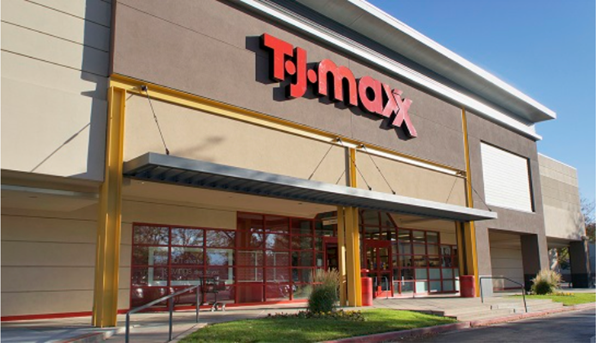

TJX 是世界最大的折扣零售商，主要卖品牌尾货、过季款、库存清货品，旗下就是你熟悉的 TJ Maxx、Marshalls、HomeGoods。它的生意本质很简单：用更低的价格卖同样的品牌商品，靠高周转和批量采购赚钱

#### 先把 TJX 放回我们现在的大环境里看。

高利率、物价死死压着，普通人银行卡见底的速度永远比工资涨得快。以前周末逛的是商场正价店，现在换成了 TJ Maxx、Marshalls 这种折扣店，理由很简单：同样一件品牌衣服，在正价店买一件，在 TJX 可以买两三件。消费者心态已经从“买最新款”变成“我要捡划算的”。这种“往下迁移”的消费趋势，就是所谓的 trade-down，而 TJX 就是专门吃这一口饭的公司。

#### 再看最新财报，TJX 不是仅仅靠讲指引（NBIS目前是在消耗自己的指引来承接自己的高股价，因此这就是NBIS为什么和过山车一样快跌快涨但是TJX不一样），而是拿数据/盈利增长的数字说话。

刚出的三季报，收入同比增长大概 7%，同店销售增长 5%，所有业务线都在涨，还是那种“全线开花式”的涨：美国主品牌 Marmaxx、HomeGoods、加拿大、国际部门，全部是正增长。每股盈利 1.28，比市场预期高了一截，利润率也稳稳在两位数之上，税前利润率 12.7%，比公司自己给的计划还高。公司顺手把全年盈利和同店销售指引都上调了一档——这在现在这种环境里，是很少数敢往上调指引的零售公司。

股价怎么反应？很诚实：今年到现在涨了十几到二十多个点，过去 12 个月整体涨幅超过 20%，明显跑赢标普，属于那种不太引人注目、但回头一看发现“怎么它又创新高了”的类型。这就是典型的防守股走势——不是拉直线暴冲，而是在每一轮“大家觉得消费者要完了”的恐慌里，靠稳稳的赚钱，把股价一点一点垫上去。

你再看它的扩张野心，就知道这家公司不是混日子的防守股。现在全球门店已经超过 5100 家，管理层把长期目标直接拉到 7000 家，多出来的近 2000 家门店，主要来自两个方向：一边是美国本土继续铺 HomeGoods、Sierra 这类子品牌，另一边是往欧洲、西班牙这些新市场扩。2024 年一年就新开了近四百家店，2025 年还在继续加速。对一个所谓“防守股”来说，这种扩店速度一点都不佛系，我个人比较喜欢叫它是一只披着防御皮的成长股

#### 真正让 TJX 成为“防守大师”的，我个人认为不是增长本身，而是它增长的逻辑：别人日子越难，它拿到的筹码越多。

供给端，品牌库存因为关税、消费疲软堆在仓库里，正价卖不动，只能打包甩给 TJX；需求端，老百姓被房租、房贷、车贷折磨到神经衰弱，还想买点东西犒劳自己，于是自然就走进了折扣店。这样一来，品牌为了活命，把货丢给 TJX；消费者为了省钱，把脚步交给 TJX。你会发现，它是站在产业链正中间，吃的就是上游太贵卖不掉+下游没钱但还想买的夹缝利润

从防守角度讲，TJX 有几个你必须看清的点。第一，它赚的是“小额但高频”的钱，日常穿的、用的、家里摆的，这些东西消费频率远远高于大件耐用品，所以现金流很稳定。第二，它没有传统百货那种“大面积打折后利润崩盘”的致命问题，因为它本身就是折扣定位，上游进货价本来就压得很低。第三，它非常分散：几千家店铺、多个品牌、多个国家，某一个区域、某个品类出问题，其他地方可以把坑填上。也正是因为这几点，最近一段时间，不少机构直接把 TJX 形容成“在衰退预期抬头时，资金躲避风险的一个口袋”，换句话说，就是大家害怕景气下行的时候，愿意把钱停在这里暂存一下

但说到这，还是要提醒你们：防守股不等于没有风险。 TJX 现在的问题很简单，太多人开始看懂它了。机构、研报一片叫好，有人说它是“off-price 之王”“零售里的堡垒”，结果就是估值被抬了上去。最近有分析直接点名：这家公司基本面很好没错，但股价已经反映了大部分优势，现在更多是好公司+不便宜的价格，这对我们来说意味着啥，意味着在这个价位，你不能拿它当小盘成长龙头去追，而要把它当成慢慢买、慢慢拿的防守组件，接受它短期可能会横、会回调，只要长期现金流没问题，就让时间帮你做事即可

#### 还有一个风险点，你们也要学会自己判断和盯新闻：TJX 的护城河虽然深，但不是没有对手。

Ross、Burlington 这些也是 off-price 模式，如果整个折扣赛道因为竞争或者线上冲击出现问题，大家一起会被估值重定价。再极端一点，如果未来通胀彻底回落、经济重回高增长，消费者重新回到爱买新款、少逛折扣店的状态，那 TJX 的增长速度也会自然放缓，股价会从防守宠儿退回一只普通优质零售股。到时候你就要重新评估它在你组合里防守的必要性，而不能永远拿它曾经在衰退预期里表现很好当免死金牌。

#### 所以，总结一下 我个人推荐的TJX 在你组合里的定位：

JNJ 是医疗那条线上的支柱股票，可以帮你对冲医药和宏观卫生风险；

TJX 则是消费那条线上的支柱股票，可以利用普通人向下消费的现实，帮你对冲通胀、关税和经济放缓的风险。一个守住“生病也得花的钱”，一个锁住“日子再难也要买点东西”的预算。两者加在一起，就是你组合里真正有防御意义的那块资产，而不是嘴上说要防守，手上全是高波动成长股和期权。

等我在后面写具体配置和建仓部分的时候，会把 JNJ + TJX 这两个防守核心写成完整的操作模板：什么资金体量配多少、什么心态适合多一点 TJX、少一点 JNJ，什么时候用它们对冲你手里那堆 data center 和半导体的情绪波动。你要做的，就是先把这家公司真正吃透——明白它为什么在你害怕的时候还能稳稳赚钱，而不是只记住一句“老师说它是防守股”。。。否则给你Jackal老师弄的像神棍一样。

#### 接下来，我们来进行我们最爱的图表分析，操作分析：

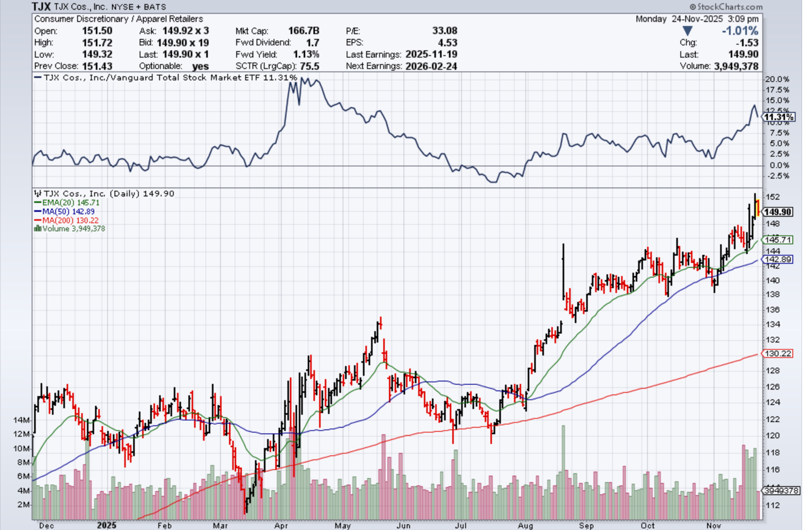

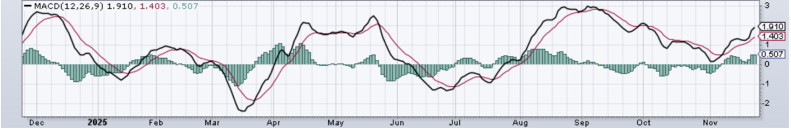

最新收在150附近，盘中最高151.7，整体就是在历史新高一带横着磨。上面那条相对强弱线已经稳稳跑赢大盘十一个点，下面日K几乎是贴着20日均线（绿线145.7）一路往上爬，50日均线在142.9，200日大趋势线在130附近，属于典型的稳步抬升结构。MACD刚从零轴附近往上拐，柱子重新翻到正区，但还没像八月那波那么疯狂，说明现在是趋势健康、但情绪不算特别亢奋的阶段，不是暴冲顶的末日狂欢，也不是没人要的冷宫价。

#### 第一步先定它在你仓位里的“工作”。

TJX这一票和强生不太一样，它不是那种“完全躺着拿股息”的老医疗，而是“宏观越拉胯、它越香”的折扣消费股。所以在整个美股仓位里，我会把它当成“消费防守前锋”：一边帮你对冲经济放缓、消费降级的风险，一边还能顺手吃一点消费恢复时的增量。给一个大致参考：如果你把防守组整体配在30%–50%这个区间（强生、TJX、再加一两只你看得懂的防御股），那单独给TJX配个5%–8%是比较舒服的；偏激进的人靠近5%，偏怕波动、又不想全仓医疗的人可以往7%、8%去靠

#### 第二步是说“现在这个价位到底干不干”。

150这里明显不是便宜货，是财报一路抬上来的高位区间，所以一定要按节奏来。我的做法很简单：先上车占坑，但别在车门口一把全梭。比如你打算最终让TJX占8%仓位，那在150这一带，你先买个3%当底仓就够了。理由和强生那段一样：一方面你承认趋势向上，不想再踏空；另一方面，也给自己留出空间——因为只要哪天市场情绪凉一点，它从150回到145其实很正常，你不想在顶部把子弹打光

#### 第三步是把“回头买点”画在图上。

现在20日均线在145.7附近，这条绿线基本就是这几个月主升途中每次回踩都会碰一下的轴心线。如果后面有那么一段，大盘或消费板块来一波正常级别的调整，TJX从150慢慢跌到146、145一带，成交量放大但没有什么新的利空，这就是你加第二层仓位的机会。那时候，你可以把原来的3%抬到6%左右，让它从“试探底仓”变成真正的核心防守股。

再往下就是蓝线，也就是50日均线现在所在的142.9附近。这个价位一般对应的是“市场整体有点慌”，可能是宏观数据砸了一下，或利率、关税又吓了大家一手。如果股价直接踩穿20日线，打到143左右，基本面你检查下来也没有本质问题（财报没崩、指引没砍、管理层没瞎搞），那这里我反而会考虑把仓位加到接近目标上限，从6%加到8%。这种位置，你的成本就不会像150那波那么尴尬，即使后面股价墨迹一阵子，你也有安全垫（专业术语叫 Buffer）。

最下面那条红线200日均线，在130附近，那是整个长周期趋势的底线。说白了，股价如果真被砸到130附近，那要么是整个市场发生一轮级别很大的恐慌，要么是TJX自身出现了大家还没完全消化的风险。这个区域我不会一上来就“英雄救美”，而是先看两件事：第一，是不是真的有结构性问题（比如扩张踩雷、库存积压、盈利连续两季明显掉下来）；第二，是不是整个off-price板块一起崩。如果只是大盘一起恐慌、估值一起杀、但TJX的赚钱怎么来的没变，那130附近会是你长线慢慢吸的深坑区域。但如果问题出在商业模式本身，那就不要用“防守股”三个字说服自己抄刀接飞刀了，直接观望，找别的防守股替换

#### 第四步说拿与卖。

TJX这一票，我也会拆成“底仓”和“机动仓”两层。底仓那部分，你就当自己持有的是“日常消费中的高性价比收费站”，它的任务是帮你在经济预期反复横跳的时候，稳住一块现金流扎实的净值；只要它能维持现在这种收入、同店销售、开店节奏，底仓就不要为了几块钱的短期波动做无意义来回。机动仓那部分，就可以盯着图和估值做。比如未来一年，如果股价从150磨到165、170，已经远远甩在20日、50日均线之上，媒体开始天天吹“折扣零售全是神股”，估值被堆得很高，这时候你就可以优先从机动仓里先砍一部分，把利润锁回口袋，顺手把钱再挪一点回高成长仓或者现金，让防守和进攻的比例回到你一开始设定的区间

#### 最后再强调一次：TJX的配仓逻辑，和你去买NVDA、PLTR是两个世界。

这里没有“几个交易日翻倍”的爽感，有的是在你下一次被AI、data center晃吐的时候，它还在默默帮你接住一部分回撤。所以你真正要学会的，不是“明天买不买得赚”，而是“在150、145、143这种不同层级的价格上，怎么分三次把8%的目标仓配完整”，然后在之后的两三年里，让这只防守股帮你扛住那些肉眼可见、但永远算不准时间点的宏观幺蛾子

### 最后第三支股票我要聊的，则是最近开始Mega7里面我认为最有潜力的并且还是在被低估的一股一只股票 Google。并且我会带你们仔细分析，为什么它最近会有如此的monster Run？同时如果你在看过我的文章的之后，很心动想购入google，我们如何在不追高的情况下指引自己在合适的地方补仓上车？

Alphabet（GOOG/GOOGL）：核心是 Google Search 广告（最大头），再加 YouTube（广告+订阅）、Google Cloud，以及现在这轮把估值抬起来的 AI（Gemini + 自研 TPU + 数据中心）。

今年以来，Alphabet 股价确实是在“七巨头”里最猛那一档，最近几周基本天天新高，市值在冲击 4 万亿这个门槛。粉丝问我：“老师，Google 这波怎么涨这么疯？还能不能追？”

我的总结是：这不是拉涨诱多，也不是市场情绪过热，是基本面+AI叙事同时重定价罢了

#### 第一层逻辑：财报和现金流，把一切情绪钉在地上！！hit it on the floor!。

Q3 2025，Alphabet 交了一份可以载入公司史的财报

单季收入第一次突破 1000 亿美金，到 1023 亿，同比增速 16%，而且是搜索、YouTube 广告、订阅、设备、Cloud 全部双位数增长，因此再投资google之前 我需要你们明白，它不是靠某一条业务硬撑，而是组合多个业务搭配AI来盈利的

更关键的是利润则是，在狂砸 AI 基建、数据中心、芯片的情况下，利润率不但没塌，反而上去了，单季利润增速接近 40%，运营利润率拉高了好几个百分点

Cloud 这块更夸张：收入同比暴增 34%，而且是带着赚钱一起长，Cloud 现在已经占总收入大概 15%，积压订单（backlog）季度环比暴涨到 1550 亿美金，说明企业客户已经签好了长期 AI 合同，钱在路上排队等入账。财报这一块的结论很简单：市场原来担心的“只砸钱不出货”的 AI 烧钱模式（比如meta，amazon这种反例），被 Google 用实打实的收入和利润打脸了

#### 第二层逻辑：AI 叙事彻底翻转，从“错过 AI”变成“google王牌回归”了

2023 年 ChatGPT 出来之后，市场一度觉得 Google AI 完全掉队，黄昏巨头这类标题你们肯定看过。结果这两季直接反杀！

Gemini 2 之后，最近推出的 Gemini 3 直接让股价单日拉了 6%，分析师普遍给出的评价是——在综合能力上对 OpenAI、Anthropic 开始全面缠斗甚至部分超越，而且背后是 Google 自己的 TPU、AI 专用数据中心在做硬件底座，长远来看对 Nvidia 的依赖度会往下降（但也不会坑了英伟达而是双向奔赴，可以看我的xhs大号贴关于其两个关系的分析）

C 端这边，基于 Gemini 的各种产品也在疯狂吸流量。之前那套 Nano Banana AI 图片工具上架后直接登顶 App Store，这几天又升级到 Nano Banana Pro，图像质量、文字渲染、和 Search 的联动全都往上提了一档Gemini 的流量占比，从年初的 5% 多涨到了接近 14%，说明用户真的在用。而不是像某国产电汽车一样只会营销。

现在市场的主线叙事基本变成：“之前Google在gpt诞生的时候纯属是错过了AI潮和发展黄金时期，但是现在的市场情况表明Google目前正在弯道超车。” 这个叙事一旦建立，给估值带来的提升是实打实的——PE 从 21 倍抬到 27–28 倍，本质上就是大家愿意为它未来的 AI 现金流多掏钱。

#### 第三层逻辑：大资金进场+估值重评。

你们可能已经刷到几条新闻：伯克希尔（巴菲特那家）披露买入 Alphabet，几个知名大佬在公开场合疯狂夸 Gemini 3，说“这是少数我会真正天天用的 AI 产品”。最近一周，Mark Benioff 这种级别的 SaaS 大佬也在公开站台

对机构来说，这种“业绩确定+AI 叙事反转+大佬背书”的组合，等于一个信号：估值可以再往上抬一层。所以你才会看到股价在短短一个季度内，又被拉出了接近 40% 的涨幅

与此同时，Google 加大了自己的AI投资力度——今年的资本开支（capex）指引再次上调到 910–930 亿美金，主要砸在 AI 数据中心、自研芯片和 Cloud 基建上。市场原来担心“花太多钱压利润”的那批人，现在看到的是：砸钱带来收入、带来 Cloud 高增速、带来更高的长期护城河，这样的花钱方式，反而会被奖励。

#### 那 Google 接下来还有多少空间，如果让我投资的话我该为什么预期买单几条主线。

第一条，是最传统但也是最赚钱的 Search + Ads。AI 搜索不是把广告业务砍掉，反而是把广告形式重做一遍：AI summary 上面挂赞助链接、结果里直接嵌入电商、订阅、地图、YouTube 视频。这部分生意，在宏观不崩掉的前提下，还能稳稳给它提供 10% 左右的年化增长。

第二条，是现在估值重定价的核心：Google Cloud + 企业级 AI。Cloud 目前只有大概 13% 市场份额，和 AWS、Azure 比还有很大追赶空间。而这次 Q3 把我们看懵的是：Cloud 不是“为了抢份额亏钱”，而是在盈利基础上跑出 34% 的增速，backlog 还暴涨，这说明 AI 真的开始成为企业 IT 预算里的刚需，而 Google 在这块的产品线（Vertex AI、Gemini Enterprise 等）确实被认可。

第三条，是 订阅和生态：YouTube Premium、YouTube TV、Google One、Play 商店，这些过去很多人当成零碎收入，现在加起来已经突破 3 亿付费用户，而且还在稳步往上爬。订阅的好处是可预期、抗周期、给估值增加稳定性。

第四条，则是长线期权：Waymo 无人驾驶、健康科技、真实世界 AI 硬件（手机、笔电、家居）。短期不要指望它们贡献多少利润，但只要有一条线被证实能真正商业化，Alphabet 这种市值体量的公司，哪怕营业利润多出来几个点，长期股价空间都是大数级别。

华尔街目前给出的预期是：Alphabet 未来三年 EPS 复合增速大概 16–17%，这还是在保守假设下算出来的数字。简单说，如果它能维持现在这种“收入双位数、利润更快一点”的节奏，再配一个相对合理的估值区间，你根本不用指望讲新故事，光靠业绩，股价在未来 3–5 年被往上推一大截是完全合理的。

当然 google尽管是mega 7，相比于我之前推荐的两只股票，这也算波动非常大的。监管和反垄断永远是一个重要的不确定性因素，大选年、贸易战、隐私法，随时有人出来敲桌子；AI 竞品压力也在——微软+OpenAI、亚马逊、国内外一堆新玩家都在抢流量、抢算力；再加上现在股价已经大涨一轮，PE 重评走了一大段，短期随时可能来一波像样的回调，用来“清掉高杠杆、清掉追高盘”。同时我会教如何抓住回调机会建仓，或者补仓。

#### 最后，说说我个人在你们组合里会怎么推荐 Google。

如果你现在的美股仓位里，AI、芯片、data center 已经把你上下波动快割的不行了，但你又不甘心完全回去只买指数，那 Google 是我会优先放进进攻核心里的那只：

它和 NVDA、TSLA 那种单一赛道高波动不一样，广告+Cloud+订阅+AI 芯片多条腿走路，赚钱能力和现金流足够厚，掉下来也有东西托着。我的打法大概是这样：

对敢承受波动、目标收益率偏高的同学，Google 可以占到整体股票资产的 10–15%。

风险偏好中性的，配个 5–8%，放在进攻仓的最核心那一层；

切记一点：一律不要配杠杆，你已经有足够多高弹性的仓位了，不需要在 Google 上再开新坑。

#### 接下来 来到了我们的图表分析和买卖策略。

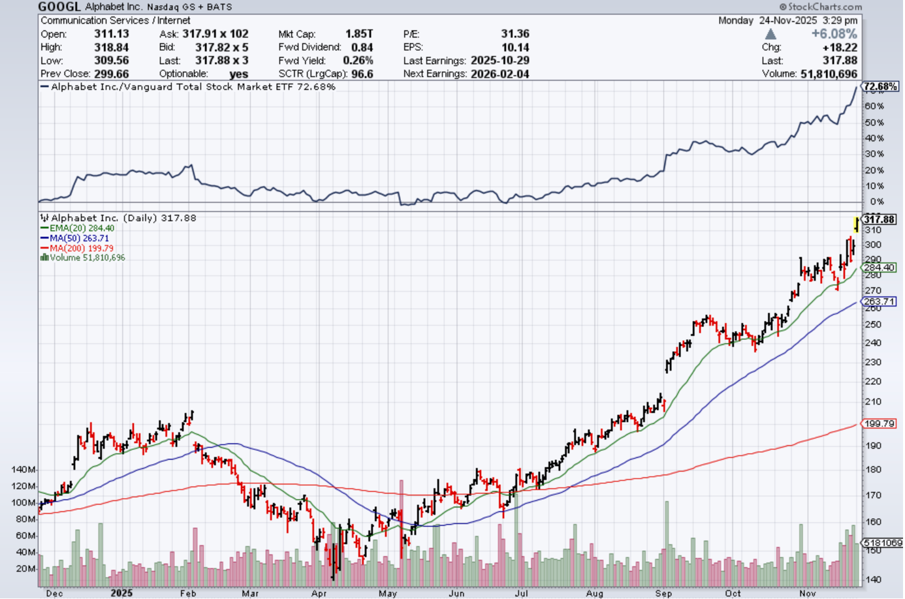

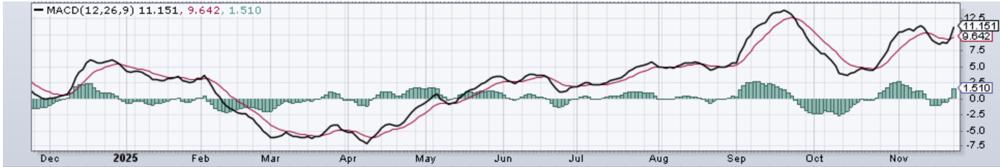

GOOGL 最新收在 317.9 左右，盘中最高 318+，单日拉出一根 +6% 的放量长阳，成交量放大到 5,000 万股级别，属于典型的“突破+确认”动作。价格直接越过并站稳前高区域，说明这不是日内噪音，而是资金在这一档位愿意继续抬价。与此同时，相对强弱线对比大盘已经领先 70+，这类强势并非短线投机，更多是中期资金持续配置的结果。

然后我们来看曲式结构，均线位置你图上很清楚，20 日约 284、50 日约 263、200 日约 200，价格远在三条均线之上，且均线呈现抬升的多头结构。问题不在于“趋势好不好”，而在于“价格离趋势轨道有多远”。此刻价格相对 20 日线偏离明显，短线处在“加速段”，这类位置的典型特征是：上涨最顺、叙事最强，但盈亏比开始恶化——买错节奏，回踩一下就会把你洗出局。

MACD 在高位再次拐头向上，属于趋势动能延续信号，但它同样提醒你：短线回撤的触发并不需要基本面恶化，只需要情绪降温或利率/监管等外生变量扰动即可。换句话说，中长期偏多的前提下，短线仍然存在“用时间换空间”或“用回撤换估值”的调整路径。交易员的应对不是争论它会不会跌，而是提前把回撤路径写进计划。

#### 因此，第一条定位必须明确：Google 是高质量进攻核心，不是防守仓位。

你可以用它提升组合的长期收益中枢，但你不能指望它在风险事件里像 JNJ、TJX 那样稳住净值。配置上我建议你把仓位分工固定下来：防守部分负责抗回撤，进攻部分负责吃趋势，现金/指数负责缓冲再平衡。Google 的仓位选择取决于你能否承受单票 20%–30% 级别的回撤：激进型可到总资产 10%–15%，中性 5%–8%，谨慎 3%–5%。统一纪律：只用现股，不用杠杆，不用短期期权去赌一段加速

参与趋势，但不在最热的时候把风险敞口一次性开满。假设你最终想配到 10%：当前 310～320 这一档只做“占位底仓”，规模 3%–4%。这样你能享受趋势延续的收益，但即使出现回撤，你也不会在情绪最亢奋的价格区间被迫止损。对交易员来说，这层仓位的意义是“获取敞口”，不是“追求最优成本”

第二层仓位只在价格回到主升轨道时加：以你图上的结构，主升轨道就是 20 日线附近（约 285）。触发条件要严格：价格回到 290–285 区间，同时成交量明显降温或至少不继续放大，且没有新的结构性利空（能改写盈利模型的那种）。满足后，把仓位从 3%–4% 加到 6%–7%。这一步的逻辑是“回归轨道时提高仓位”，而不是“越涨越加”

第三层仓位只留给市场情绪抽风的深回撤：50 日线附近（约 263）。这通常发生在利率快速上行、监管冲击、或AI板块整体风险偏好回撤时。触发条件同样要刚性：价格跌到 265–260，并出现承接特征（跌势放缓、下影线、横盘止跌），同时你复核指引与核心业务没有被改写。满足后把仓位补到计划上限 8%–10%。这样你的综合成本大概率会落在 280 一带，既避免在 318 附近重仓接力，也避免等完美低点导致踏空。

如果市场不给回调、继续加速上行，你也必须有一套不接飞刀但不踏空的规则：只允许趋势确认后小步跟，不允许看到涨就追到满仓，具体做法是：当价格突破后连续两天收盘站稳新高区（例如稳定站在 318 上方），你可以把底仓从 3%–4% 小幅提高到 4%–5%，然后停止追价，剩余仓位仍然留给 20 日/50 日回踩。你需要接受一个交易员常识：少赚一段加速，换取不在热区暴露过多风险，这是主动选择，不是失误（如果小白看不懂属于则需要结合AI去学习我的内容，同时把我的打法给AI让它帮你判断是否符合我所说的条件）

风险控制必须写成失效条件，否则你所有分层都是空话。短线层面，如果价格有效跌破 20 日线并且连续数日收不回去，那说明节奏从“加速”进入“降速”，机动仓位应当先降低风险敞口，等待结构重新站回轨道。中线层面，如果跌破 50 日线且反弹无力、持续收不回去，那更可能是趋势换档，此时停止加仓，优先保留现金与防守仓，等它重新构建上升结构再评估。注意，这里我讲的是“结构失效”，不是让你被一根阴线吓跑

#### 最后是再平衡与减仓规则，这恰恰是高涨不接飞刀的根本。

你把 Google 拆成两部分：长期底仓不轻易动；机动仓只为管理风险。当价格持续远离 20 日线、连拉放量阳线、MACD 高位钝化/背离、市场情绪开始极端一致时，你不需要看空公司，但你应该从机动仓里减一部分，把利润锁回现金或防守组。这样下一次回撤你有子弹把成本做回轨道，而不是只能在恐慌里被动挨打

GOOGL 当前处在趋势加速段，方向偏多但价格偏贵；正确打法不是预测明天涨跌，而是用“底仓占位 + 轨道回踩加仓 + 深回撤补仓 + 明确失效条件 + 机动仓再平衡”把风险写死，做到参与趋势，同时避免在最热的右侧用情绪把仓位拉满

#### 投资需谨慎，如果基本面没有重大变化我则维持我的观点，如果有变我会及时发帖通知。我已尝试把文章，打法，叙事写得非常全面，如果你完全看懂了就不会依赖于我时时刻刻在指引你去打短线，我从最一开始就说了，通过我的指引打短线很不现实，详细原因我在之前的帖子反复有强调。

#### 祝大家投资愉快。

### 因为我本身是Quant，鉴于很多朋友都在讲让我仔细标注出风险和可能的收益，我决定进行策略组合，历史回测，以及最新市场环境下的风险压力测试，同时我会传授你们如何理解这些量化研究才会接触到的图表。目的是彻底断档与xhs的业余博主拉开差距，thats it。

因此我要做两件事，第一我会给出每一个股票的配比 然后进行历史回测用来检测三只股票搭配起来的整体收益率，同时会比较QQQ（作为我们的benchmark），来看我们比QQQ的收益好多少？

我的逻辑和计划是这样的，假设我拿我的全部仓位来配这三只股票（如果你想拿20%的仓位来配也没问题，可以refer我的配仓百分比作为例子。），我会有两种比较常见的搭配方式，也比较清晰易懂。

两个搭配组合，我这里会叫的专业一点叫做Portfolio，中文是投资组合。

投资组合A，偏保守型打法配比，我会给JNJ，TJX各配 40%，google作为高波动我们给它20%的配重。

投资组合B，偏激进型打法配比，我会降低JNJ，TJX的配重至30%，同时调高Google的比重为40%。

我们用大盘QQQ来作为收益对比。

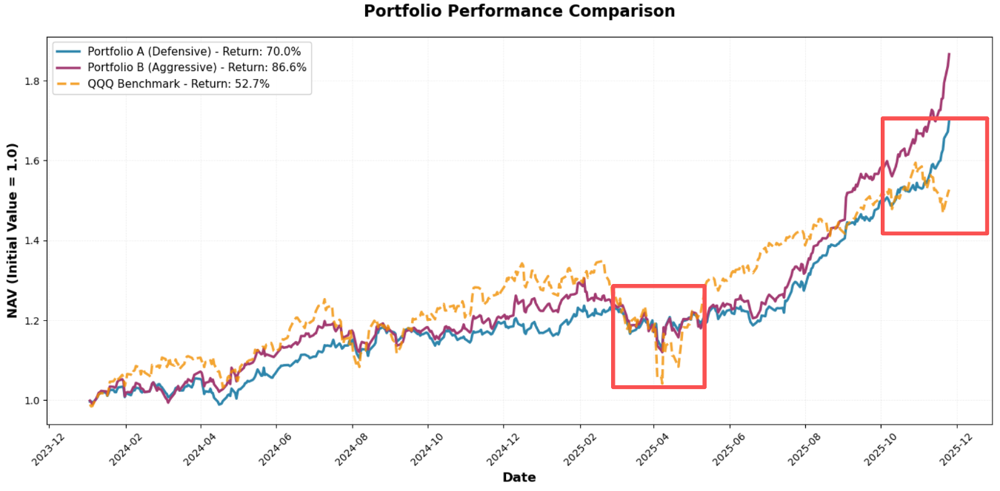

以上是我们回测图，回测区间为2023年12月到2025年的今天（尽管2025-12在x轴但是回测并不会到那一天）。总共回测期间为两年。选择这两年的原因很简单，因为AI爆发外加疫情结束，这两年更加符合现代市场。

看整体两个策略，尽管2023年12月到2025年8月份左右收益率相较于QQQ低，但是不要忘了，这仅仅是我们只有防御股外加一个mega cap的情况，我们的目的就是做到在大盘跌的时候维稳，在该超的时候超越。

因此你仔细看2025-04月，libration day的那一阵子，大盘暴跌狂泻，但是我们的两个回测组合却相较稳健，下一个点看2025-10月这个节点，我们的防御股+一个成长股反超了QQQ在大盘整体因为AI bubble担忧并且12月不降息担忧导致狂泻的情况下。最终我带你们看我这边计算出来的数据。

投资组合A，这套组合的特点是“波动小，但收益稳定”，总收益大约 70%，年化回报 32%，整体表现很好。最重要的是，回撤只有 -8.44%，在震荡和下跌阶段都保持得住，不会出现明显的大幅下滑。

波动率 12.97% 属于比较低的水平，说明价格上下波动不激烈。β值为 0.27，表示它受大盘影响非常小。

因此按照4，4，2的配比我们的收益不错，风险很低，走势平稳。

投资组合B，这套组合把更多权重给了成长性更高的 GOOGL，所以收益提升明显。总收益达到 86%，年化回报 39%，是三者里表现最强的。但它的回撤扩大到 -14.18%，波动率也增加到 15.35%。β 0.43，它受到市场上涨或下跌的影响更明显。

因此按照3，3，4的配比我们的收益更高，但波动更大，回撤也更深一些，但是这要比纯tech的投资组合要强很多。

两套 2 防 1 攻组合都明显优于 QQQ。首先，它们的回撤都更小，QQQ 最大跌幅接近 -23%，而偏防守的组合只有 -8%，偏进攻的组合也只到 -14%，整体抗跌性强得多。其次，它们的波动率远低于 QQQ，资金曲线更平稳，持仓压力更小。再来看风险调整后的表现，A 和 B 的 Sharpe 都在 2 以上，而 QQQ 只有 0.99，说明在承担同样风险的情况下，这两个组合给的回报更多。β 也明显偏低，不会跟着大盘一起大幅震荡。最终落到结果，两套组合的总收益分别达到 70% 和 87%，都高于 QQQ 的 53%。整体来看，这两个组合在收益、回撤、波动和稳定性上都全面优于 QQQ，更适合作为稳健、可持续持有的核心仓位。

#### 接下来我们对我们的两个组合进行压力测试。

在做之前我想快速解释一下什么是压力测试，还有其意义。压力测试是为了去测试一套投资组合是否能在突如其来的事件冲击（黑天鹅事件尤其）下能扛得住风险，如果跌能跌多少钱，这套压力可以帮助你理解，如果未来12月降息事件落空，以及AI bubble突然破裂导致等突发事件所导致的大盘崩溃，我的这三只股票组合（组合A，B）相较于大盘的最大跌幅是多少，你是否能承受？

让我仔细讲解一下我是如何定义未来12月降息事件落空 以及 AI bubble突然破裂的市场情形。

#### 第一个情景是“降息预期落空”。

这是目前交易最拥挤的一条预期链，假设市场默认明年会降息 3 次，如果最后只给 1 次来模拟12月降息落空这件事，而点阵图进一步偏鹰，长端利率重新上到 50–75bp，更高久期、估值更敏感的科技和 AI 会直接被压估值。这个情景里，我假设高 PE、高久期科技板块整体下跌 20–30%，防御板块和消费必需品下跌 5–10%，大盘的整体表现类似 2018 年那种中等规模的 ~15% 回调。用这套冲击去重新测算 QQQ、组合 A 和组合 B，各自的单次下跌幅度是多少，就能清楚看到：在降息预期出现偏差的时候，哪套组合最抗压、哪套组合回撤最小。

#### 第二个情景是“局部泡沫破裂 / AI re-rating”。

这不一定意味着经济衰退，只代表资金从最拥挤、估值最高的主题撤出。这里我设定 AI / 半导体 / 高 beta 成长股统一下跌 30–40%，其他普通科技股下跌 15–20%，防守股和价值股大概只有 0 到 -5% 的调整，大盘整体大约 -10%。这个情景的目的很清楚，就是回答读者心里最关键的那句话：如果 AI 主题被砍 30–40%，我这套 2 防 1 攻组合会不会一起被拖下水？通过把这组冲击重新施加到 QQQ、组合 A 和组合 B 上，就能看到真实的相对抗跌性和组合结构对主题风险的敏感度。

这两个压力测试，一个对应宏观预期偏差的风险，一个对应主题估值下杀的风险，都是现在市场最有可能触发波动的两类情景！！所以我才用这两个情形来做压力测试。

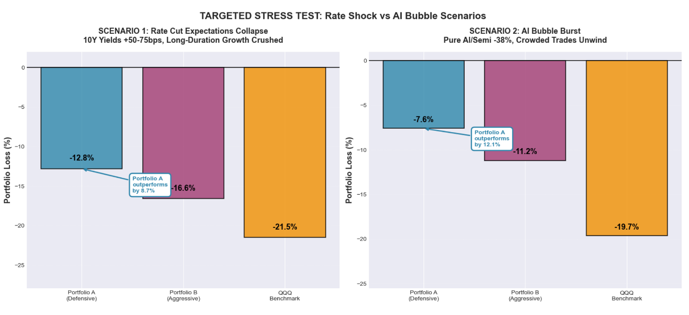

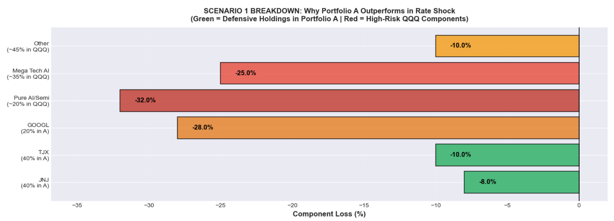

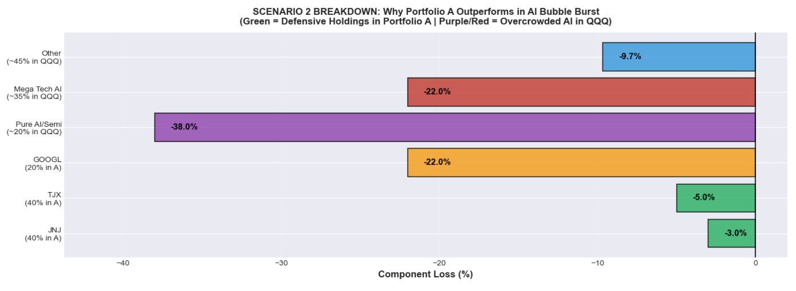

先看第一张图（利率冲击）。在“10 年期收益率再飙 +50–75bp、市场预期的 3 次降息只剩 1 次”这种情况下，最容易被打爆的就是长久期、高估值、高 Duration 的科技股。图里你可以很清楚看到：QQQ 直接跌到 -21.5%，而组合 A 只跌 -12.8%，组合 B 跌 -16.6%。只要长端利率一上去，分散在 JNJ + TJX 这种防御资产的组合，就是比定投科技的指数（QQQ）抗打

第二张图（AI bubble）。这是现在市场最怕的情景，不是衰退，而是主题拥挤 + 高估值被无情砍 PE。图里 QQQ 的核心 AI 权重（纯 AI/Semi、Mega Cap AI）几乎是 -22% 到 -38% 的区间，而组合 A 因为只有 20% 在 GOOGL，剩下 80% 都是防御，所以最终回撤只有 -7.6%；组合 B 虽然更激进，也只是 -11.2%。对比一下 QQQ 的 -19.7%，差距非常显著。也就是说，就算市场来一轮AI 去泡沫化，你的组合也不会一起Crash

最后两张长条图，是把每个板块拆开，为什么组合 A/B 会比 QQQ 更稳？

看QQQ 那些紫色/红色部分（纯 AI、半导体、拥挤的 mega tech）在两个压力场景里几乎都是被凌迟式暴跌，而组合 A/B 的绿色部分（JNJ、TJX）几乎不怎么动，等于帮你把整个回撤硬生生拉住了。这就是防御组合结构的价值，绝对不是赌对方向，而是把最容易被宰的风险暴露降到最低

## 免责声明

## 本文内容仅供学习交流和市场研究参考，不构成任何形式的投资建议或买卖依据。股票市场有风险，投资需谨慎。文中观点仅代表作者个人看法，与任何机构无关。读者在做出投资决策前，应根据自身情况独立判断，并自行承担相应风险和后果。