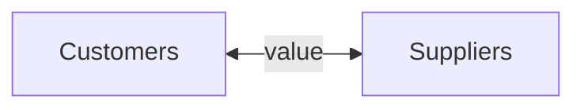

## What is Marketing
Exchange of value between customers and suppliers

## Marketing Process
Create value for customers
![[Ust_Note/yr2_Fall/MRKT2120/attachments/Pasted image 20250908212253.png]]

- Analysis & Research
	- 3C: Customer + Company + Competitors
- Strategic Planning
	- STP
		- Segment: Who is likely to buy?
		- Target: Who are we trying to delight?
		- Position: Unique Selling Proposition (USP)
- Implementation
	- 4P (**marketing mix**): Price + Product + Promotion + Place (distribution channels)
## Marketplace Concepts
- Needs $\to$ Wants $\to$ Demands
![[Ust_Note/yr2_Fall/MRKT2120/attachments/Pasted image 20250908213835.png]]
- Market Offerings: combination of products, services, information, or experiences offered to a market to satisfy a need or want
- Marketing Myopia (short-sighted): paying more attention to the specific products than to the benefits and experiences produced
	- e.g. Nokia, Kodak
### Marketing Management
combination of products, services, information, or experiences offered to a market to satisfy a need or want
- Who to serve
	- Target market
- How to serve
	- Value Proposition
#### Orientations
- Production concept
	- availability and affordability
	- improving production and distribution efficiency
- Product concept
	- quality, performance and innovative features
	- improving products
- Selling concept
	- Inside-out perspective
		- starts with existing products
		- heavy selling and promotion
		- short-term sales
	- vulnerable to potential marketing myopia
- Marketing concept
	- Outside-in perspective
		- starts with a well-defined market
		- produce what customer needs
		- long-term customer relationships
- Societal Marketing
	- consumers' long-run interests
	- society's long-run interests
- Production concept and Product concept are vulnerable to potential marketing myopia
#### Customer-Engagement Marketing
Fosters direct and continuous **customer involvement** in shaping brand conversations, experiences, and community.
- user community
#### Customer-Generated Marketing
Brand exchanges using **user-generated contents**
- tailored flavor
#### Customer Relationship Tools
- Frequency marketing programs
	- Airline miles
	- Hotels' room upgrades
- Club marketing programs
	- Apple's training classes
#### Partner Relationship Management
work with partners to jointly bring greater value to customers
- credits card with airline company
## Customer Value
### Customer Lifetime Value (CLV)
- CLV: The value of the entire stream of purchases customer would make over a lifetime of patronage.
- Share of Wallet (SOW): The portion of the customer's purchasing that a company gets in its product categories.
- Customer Equity: The total combined customer lifetime values of all of the company's customers.
- Churn rate: 1 - Retention rate
- $\text{Lifetime of a Customer} =\frac{1}{\text{churn rate}}$
- CLV = contribution of customer per year $\times$ lifetime
- Customer equity = CLV $\times$ number of customers
## Customer Relationship Groups
![[Ust_Note/yr2_Fall/MRKT2120/attachments/Pasted image 20250909172606.png]]
Get rid of barnacles by raising fees or reducing service.

## Q&A
过度广告in app
research papers