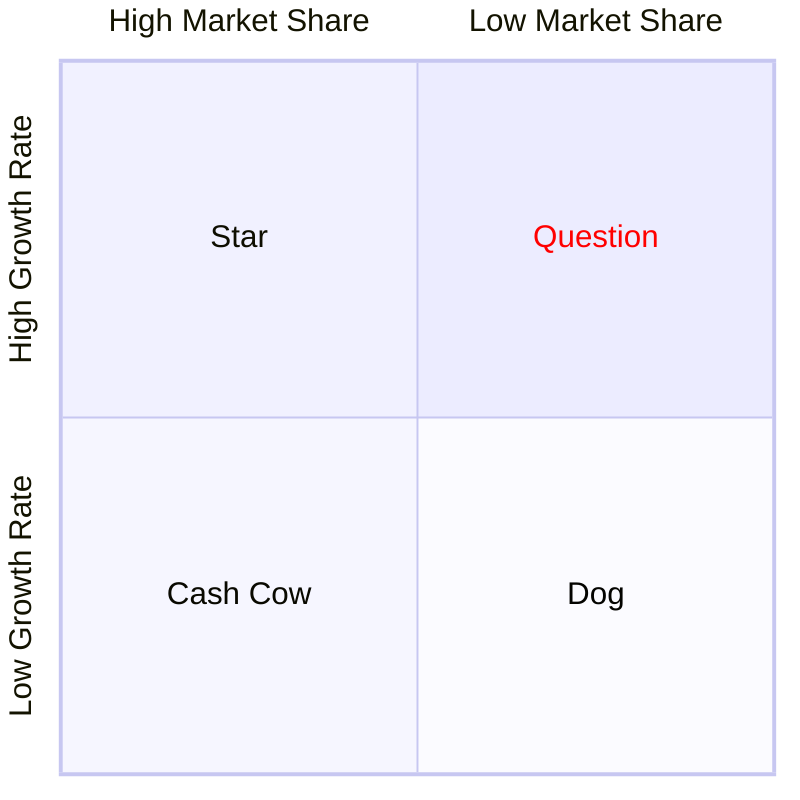

## Mission Statement
1. Key Market (customers)
2. Contribution (products/services)
3. Distinction (competencies)
- Market-oriented instead of product-oriented definition
- redefine mission to avoid marketing myopia
- Short term goals versus long term mission
	- $\text{Goal}=\text{Criterion}+\text{Benchmark}$
## Business Portfolios
collection of businesses and products that make up the company
### Strategic Business Units (SBU)

### Brand Architecture Consideration
|            | branded house | house of brands|
| :--------- | :-----------: | :------------: |
| Cost       |+|-|
| Visibility |+|-|
|Synergy     |+|-|
|"Freedom"   |-|+|
|Distribution Channels |more conflicts |less conflicts|
|Risk| riskier | less riskier |
Hybrid: Confusion
### BCG

