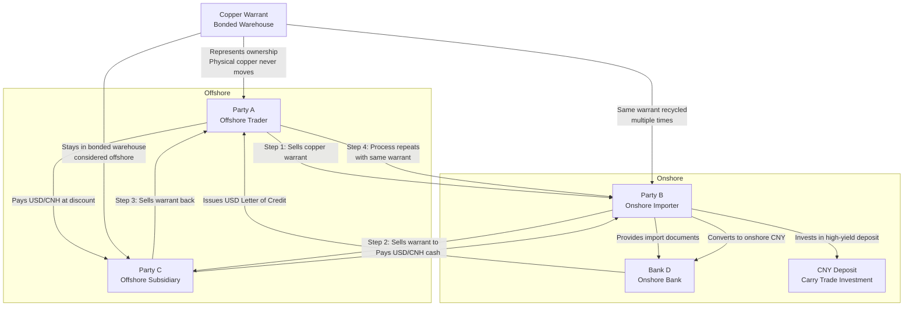

## Types of Currencies
- World's dominant currency: USD
	- large proportion of the reserves of central banks
	- predominantly used for international trade
	- safe-heaven
	- no necessarily risk-free
- Major reserve currency: EUR, JPY, GBP, CHF (Swiss franc)
	- can move against USD
- Commodity currency: AUD, CAD, NZD
	- countries depend heavily on the export of raw material
- Pegged currency: HKD
	- (almost) fixed exchange rate against USD

## Exchange Rate Quotes
XXX/YYY: how much of the ==quote currency (YYY)== is needed to buy one unit of the ==base currency (XXX)==

## Currency Forward to Hedge FX Risk
A U.S. fund invest \$1 million in government bonds for one year, ether in Hong Kong or in London

While HKD/USD is fixed, GBP/USD is expected to increase to $S_{T}^{GBP}=1.658$ or decrease to $S_{T}^{GBP}=1.20$ with equal probability.

To hedge the risk of **GBP depreciation** (decreasing GBP/USD), the fund can **short** GBP forwards.

The short side will sell GBP at maturity by receiving the forward price of $F_{0,T}=\$1.429$ for each $\textsterling 1$

![[Pasted image 20250927012058.png]]

## Forward Exchange Rate
The pre-agreed exchange rate for a currency pair, i.e., the "forward price" (in quote currency) the long side need to pay to buy the "underlying" (base currency).

Assume the quote currency is USD. The continuously-compounded US interest rate is $r$, and the foreign rate is $r*$.

Since $r*$ is the interest rate of the underlying (base currency), it can be viewed as the [[L3 - Forwards and Futures on Commodities#Yield on Forward Price|dividend yield]] generated from holding base currency.
$$F_{0,T}=S_{0}e^{(r-r*)T}$$
$S_{0}$ is the spot exchange rate
$F_{0,T}$ is the forward exchange rate

## Covered Interest Rate Parity (CIP)
When the forward rate is $F_{0,T}=S_{0}e^{(r-r*)T}$, there is no arbitrage opportunity. This is called the CIP condition.

![[Pasted image 20250927021018.png]]

## Uncovered Interest Rate Parity (UIP)
When arbitrage fails
