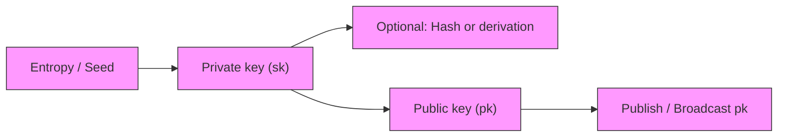

# Blockchain Technologies
## Distributed and Decentralized
- Distributed
	- 
- Decentralized
	- 
## Cryptographic Hash Function
![[Pasted image 20260206143507.png]]

$$x \to H(x)$$
A hash function takes any string of arbitrary size as **input**, and **outputs** a fixed-sized 256-bit integer (64-digit hexadecimal number)

> [!abstract] Properties
> - **Determinism**
> 	- For any given input $x$, the output $H(x)$ must **always** be the same.
> 		- *Note:* Otherwise, data verification would be impossible.
> - **Efficiency**
> 	- The computation time is linear in $n$ for an $n$-bit string ($O(n)$ complexity).
> - **Collision Resistance** 
> 	- It is **infeasible** (not impossible) to find two values $x \neq y$ s.t. $H(x) = H(y)$.
> - One-way Trapdoor
> 	- no pattern for reverse-engineer 
> 	- $2^{256} \approx 1.16 \times 10^{77}$ possible outputs took (on average) more than the age of universe for brute-force attempts to succeed
> - Avalanche effect
> 	- a small change in input will generate a completely different output

> [!tip] Collision Resistance
> Since the input domain is infinite with a finite output range, collision must exist mathematically but finding them is computationally infeasible since
> - Astronomically large output space
> 	- effectively zero possibility to accidentally find collision
> - Avalanche effect
> 	- no mathematical shortcut to predict except brute force
> - One-way Trapdoor
> 	- no reverse-engineer
>- $2^{256} \approx 1.16 \times 10^{77}$ possible outputs took (on average) more than the age of universe for brute-force attempts to succeed

## Blockchain

![[Pasted image 20260205134200.png]]

- Linked series of blocks
- Each contains data, the hash of the previous block, and a pointer to the previous block

## Cryptographic in Blockchain

- Cryptographic Hash Function
- Public-key Cryptography

- Key generation:
	- Randomly drawn private keys -> Hash -> public keys -> Broadcast
	- Private and public key pair: $(sk,pk)$

- Signature:
	- $sig=sign(sk,message)$
- Verification:
	- $verify(pk,message,sig)==True \iff$ $pk$ and $sk$ are paired

### Digital Signatures
